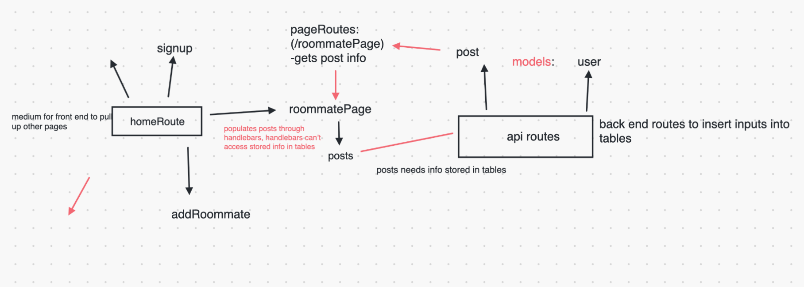

# Rate Your Roommate

## Description

When it comes to looking for a roommate, it is important to know if they would be the right fit. There have been many times where people have found a roommate through Cragslist or another way without proper vetting. With Rate Your Roommate, you will be able to see if the person you want to room with is the perfect fit through such information as where they currently room and some of their habits. Think of it as a sort of Yelp, but for finding a roommate. We learned as a group to incorporate routes, pure css framework, mysql and others. Our website is simple and has an easy user interface.

### Deployed Link

- https://rate-my-roomie.herokuapp.com/

## Tools Utilized

   
  

## Table of Contents (Optional)

- [Description](#description)

- [Tools-Utilized](#Tools-Utilized)

- [Installation](#installation)

- [Usage](#usage)

- [License](#license)

- [Contribution](#contribution)

- [Challenges](#challenges)

- [Questions](#questions)

## Installation

No installation required for user, just access to the web.

## Usage

As a user, you will be prompted to either login or sign up in order to view or post Roomies.
After which, you will be redirected page that shows all posts of roommates. On this page a user is able to add their past roommates.

## License

  
This application is under the MIT

## Contribution

### Resources of significance:

 

Special thanks to [Ileriayo Adebiyi](https://github.com/Ileriayo/markdown-badges#testing) for his public library of common badges!

## Challenges

Some of the challenges we faced were due to the speed of development. Since we're all still rather new at implementing back end concepts, our saving grace was our teamwork and flexibility. Having to redirect, reorganize, and simplify got us to at least an MVP. We originally wanted a more dynamic post page that would render a dashboard of preview posts that has some information of the roommate post. Once that post is clicked, it would've redirected to a single post page that renders expanded information about the roommate. That info would've been pulled from the addRoomate page, and render in a table of star ratings to reduce personal biases for potentially angry roommates creating the post. After numerous discussions going over the logic of our page, we opted for a more simplistic design until we further develop our back end skill. This was overrall an ambitious project with a lot of great ideas that just require some more time develop it into a more polished and dynamic page.

## Questions

Any concerns or questions, please contact us at through github
 

- [Lilia Hernandez](https://github.com/lhern222)
- [Aldo Ibuado](https://github.com/aldoibuado)
- [Leann Labra](https://github.com/leann-labra)
- [Cherie Walker](https://github.com/Cherie2)
